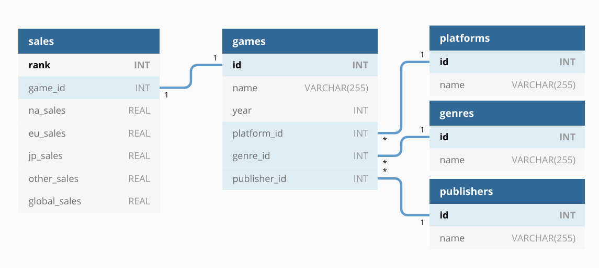
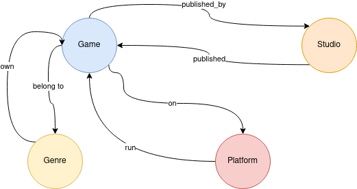
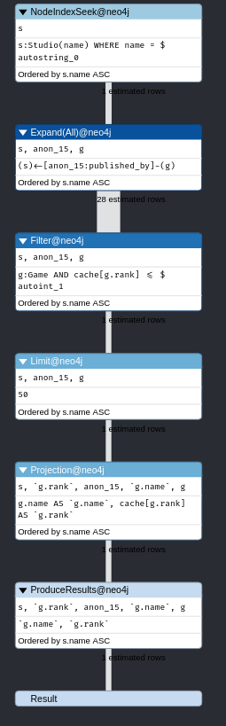
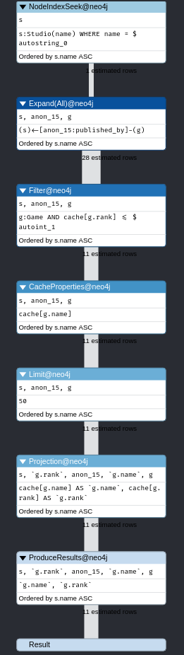
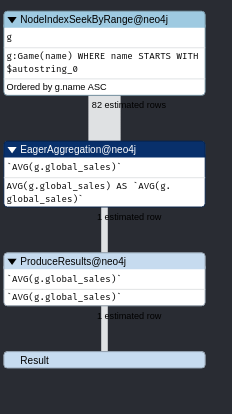
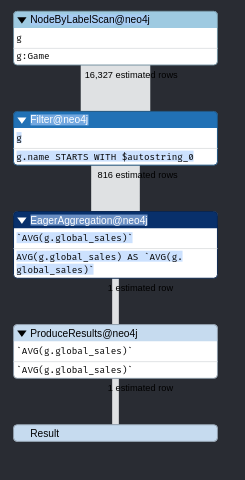
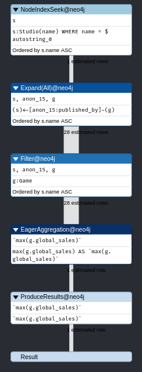
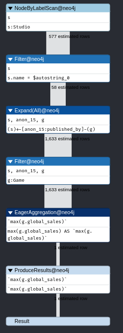

# Bases de données avancés

- [Bases de données avancés](#bases-de-données-avancés)
  - [Auteurs](#auteurs)
  - [Sujet](#sujet)
  - [Imports](#imports)
    - [PostgreSQL](#postgresql)
      - [Modélisation](#modélisation)
      - [Chargement des données](#chargement-des-données)
    - [Neo4j](#neo4j)
      - [Modélisation](#modélisation-1)
      - [Chargement des données](#chargement-des-données-1)
      - [Stratégie de chargement](#stratégie-de-chargement)
    - [Contraintes](#contraintes)
    - [Indexes](#indexes)
  - [Requêtes](#requêtes)
    - [Cypher](#cypher)
      - [NORMAL](#normal)
      - [GDS](#gds)
    - [PostgreSQL](#postgresql-1)
      - [Requêtes équivalentes](#requêtes-équivalentes)
      - [Requête récursive](#requête-récursive)
  - [Comparaison des requêtes](#comparaison-des-requêtes)

## Auteurs

- Félix Desmaretz 71602425
- Étienne Marais 71600178

## Sujet

_Lien du sujet :_ <https://moodle.u-paris.fr/pluginfile.php/609239/mod_assign/introattachment/0/projetBDspe.pdf?forcedownload=1>

Set de données : <https://www.kaggle.com/gregorut/videogamesales>

## Imports

### PostgreSQL

#### Modélisation

Le schéma Entités/Relations est le suivant:



```postgresql
DROP TABLE IF EXISTS platforms CASCADE;
DROP TABLE IF EXISTS genres CASCADE;
DROP TABLE IF EXISTS publishers CASCADE;
DROP TABLE IF EXISTS games CASCADE;
DROP TABLE IF EXISTS sales CASCADE;

CREATE TABLE platforms (
    id INT GENERATED ALWAYS AS IDENTITY,
    name VARCHAR(255) NOT NULL UNIQUE,

    PRIMARY KEY(id)
);

CREATE TABLE genres (
    id INT GENERATED ALWAYS AS IDENTITY,
    name VARCHAR(255) NOT NULL UNIQUE,

    PRIMARY KEY(id)
);

CREATE TABLE publishers (
    id INT GENERATED ALWAYS AS IDENTITY,
    name VARCHAR(255) NOT NULL UNIQUE,

    PRIMARY KEY(id)
);

CREATE TABLE games (
    id INT GENERATED ALWAYS AS IDENTITY,
    name VARCHAR(255) NOT NULL,
    year INT NOT NULL,
    platform_id INT NOT NULL,
    genre_id INT NOT NULL,
    publisher_id INT NOT NULL,

    PRIMARY KEY(id),
    CONSTRAINT fk_platform_id FOREIGN KEY(platform_id) REFERENCES platforms(id) ON DELETE CASCADE,
    CONSTRAINT fk_genre_id FOREIGN KEY(genre_id) REFERENCES genres(id) ON DELETE SET NULL,
    CONSTRAINT fk_publisher_id FOREIGN KEY(publisher_id) REFERENCES publishers(id) ON DELETE CASCADE,
    CONSTRAINT unique_multiple_key UNIQUE (name, year, platform_id, genre_id, publisher_id)
);

CREATE TABLE sales (
    rank INT,
    game_id INT NOT NULL UNIQUE,
    na_sales REAL NOT NULL,
    eu_sales REAL NOT NULL,
    jp_sales REAL NOT NULL,
    other_sales REAL NOT NULL,
    global_sales REAL NOT NULL,

    CONSTRAINT pk_rank PRIMARY KEY(rank),
    CONSTRAINT fk_game_id FOREIGN KEY(game_id) REFERENCES games(id) ON DELETE CASCADE
);
```

#### Chargement des données

On crée une table temporaire qui suit le même schéma que notre fichier CSV contenant le dataset.

```postgresql
DROP TABLE IF EXISTS temp;

CREATE TABLE temp (
    rank INT,
    name VARCHAR(255),
    platform VARCHAR(255),
    year INT,
    genre VARCHAR(255),
    publisher VARCHAR(255),
    na_sales REAL,
    eu_sales REAL,
    jp_sales REAL,
    other_sales REAL,
    global_sales REAL
);
```

Avec l'utilitaire `psql`, on importe le-dit fichier CSV dans notre table:

```psql
\copy temp FROM '<chemin_du_dépot>/vgsales.csv' WITH (FORMAT CSV)
```

On néttoie quelques données, que ce soit les entrées incomplètes ou les duplicatas.

```postgresql
-- Delete incomplete rows
DELETE FROM
    temp
WHERE
    name IS NULL
    OR platform IS NULL
    or year IS NULL
    or publisher IS NULL
    or genre IS NULL;

-- Remove duplicates
WITH -- Find duplicates
dup1 AS (
    SELECT
        name,
        platform,
        "year",
        genre,
        publisher,
        COUNT(*)
    FROM
        temp
    GROUP BY
        name,
        platform,
        year,
        genre,
        publisher
    HAVING
        COUNT(*) > 1
),
-- rank duplicates
dup2 AS (
    SELECT
        temp.rank,
        row_number() OVER(
            PARTITION BY temp.name,
            temp.platform,
            temp.year,
            temp.genre,
            temp.publisher
            ORDER BY
                temp.rank ASC
        ) AS rk
    FROM
        dup1
        JOIN temp ON dup1.name = temp.name
        AND dup1.platform = temp.platform
        AND dup1.genre = temp.genre
        AND dup1.publisher = temp.publisher
) -- delete duplicates of rank > 1 (only keep first occurrence)
DELETE FROM
    temp
WHERE
    rank IN (
        SELECT
            rank
        FROM
            dup2
        WHERE
            rk > 1
    );

```

Puis commence la répartition et population des différentes tables:

```postgresql
-- Populate publishers
INSERT INTO
    publishers(name)
SELECT
    DISTINCT publisher
from
    temp ON CONFLICT DO NOTHING;

-- Populate platforms
INSERT INTO
    platforms(name)
SELECT
    DISTINCT platform
from
    temp ON CONFLICT DO NOTHING;

-- Populate genres
INSERT INTO
    genres(name)
SELECT
    DISTINCT genre
from
    temp ON CONFLICT DO NOTHING;

-- Populate games
WITH t AS (
    SELECT
        DISTINCT temp.name AS name,
        temp.year AS year,
        platforms.id AS platform_id,
        genres.id AS genre_id,
        publishers.id AS publisher_id
    FROM
        temp
        LEFT OUTER JOIN publishers ON publishers.name = publisher
        LEFT OUTER JOIN genres ON genres.name = genre
        LEFT OUTER JOIN platforms ON platforms.name = platform
)
INSERT INTO
    games(name, year, platform_id, genre_id, publisher_id)
SELECT
    *
FROM
    t;

-- Populate sales
WITH t AS (
    SELECT
        temp.rank AS rank,
        games.id AS game_id,
        temp.na_sales AS na_sales,
        temp.eu_sales AS eu_sales,
        temp.jp_sales AS jp_sales,
        temp.other_sales AS other_sales,
        temp.global_sales AS global_sales
    FROM
        temp
        LEFT OUTER JOIN publishers ON publishers.name = publisher
        LEFT OUTER JOIN genres ON genres.name = genre
        LEFT OUTER JOIN platforms ON platforms.name = platform
        LEFT OUTER JOIN games ON games.platform_id = platforms.id
        AND games.genre_id = genres.id
        AND games.publisher_id = publishers.id
        AND games.name = temp.name
        AND games.year = temp.year
)
INSERT INTO
    sales(
        rank,
        game_id,
        na_sales,
        eu_sales,
        jp_sales,
        other_sales,
        global_sales
    )
SELECT
    *
FROM
    t;
```

### Neo4j

#### Modélisation

La modélisation de la base de données sous forme de graphe est la suivante :
  


- Chaque jeu est représenté avec son nom, son année de sortie et son pourcentage de vente dans le
  monde. Un jeu peut être présent plusieurs fois avec différents pourcentages de ventes correspond à
  différentes trimestres (non précisé dans les données) ainsi qu'à différentes plateformes.
- Les jeux sont reliés aux genres auxquels ils appartiennent.
- Ils sont aussi reliés à la console sur laquelle ils sont présents.
- Enfin, ils sont connectés au studio qui les as conçus.

#### Chargement des données

Pour pouvoir charger les données les données de ventes dans **Neo4j**, il faut absolument augmenter
la mémoire disponible en changeant la ligne suivante dans le fichier _neo4j.conf_ :

```conf
dbms.memory.heap.max_size=5G
```

La requête qui permet de charger les données est la suivante:

```cypher
LOAD CSV WITH HEADERS FROM "file:/vgsales.csv" as vg
WITH vg WHERE vg.Year IS NOT NULL
AND vg.Global_Sales IS NOT NULL
AND vg.Year <> "N/A"
AND vg.Global_Sales <> "N/A"
MERGE (game:Game{
    name: vg.Name,
    rank: toInteger(vg.Rank),
    year: toInteger(vg.Year),
    global_sales: toFloat(vg.Global_Sales)
})
MERGE (studio:Studio {
    name: vg.Publisher
})
MERGE (genre:Genre {
     name: vg.Genre
})
MERGE (platform: Platform {
     name: vg.Platform
})
MERGE (game)-[:belong_to]->(genre)
MERGE (game)-[:published_by]->(studio)
MERGE (game)-[:on]->(platform)
MERGE (genre)-[:own]->(game)
MERGE (studio)-[:published]->(game)
MERGE (platform)-[:run]->(game)
```

#### Stratégie de chargement

Dans le fichier contenant les données, lorsqu'une donnée n'est pas présentes, elle est remplacée par
la chaîne de caractères "N/A". Ainsi, lors de l'import, on s'assure que la donnée possède une année
de sortie et un pourcentage de ventes avec la vérification sur NULL et, si c'est le cas, on enlève
toutes les données où cette information n'est pas renseignée.

Nous avons fait le choix de construire tout le graphe en un chargement de données car le fichier
n'est pas trop gros et son importation est largement supportable pour un PC de 8G de RAM. Une autre
solution pour limité le coup aurait été de le construire en plusieurs fois en prenant d'abord les
jeux puis en construisant les studio, les gens et les plateformes. Enfin, en ajoutant tous les liens
qui les connectent.

Nous utilisons la commande _MERGE_ car cela permet de relancer la création autant de fois que l'on
souhaite sans créer de duplicata.

### Contraintes

```cypher
CREATE CONSTRAINT game_name IF NOT EXISTS ON (g:Game) ASSERT EXISTS (g.name);
CREATE CONSTRAINT game_year IF NOT EXISTS ON (g:Game) ASSERT EXISTS (g.year);
CREATE CONSTRAINT game_global IF NOT EXISTS ON (g:Game) ASSERT EXISTS (g.global_sales);
CREATE CONSTRAINT studio_name IF NOT EXISTS ON (s:Studio) ASSERT EXISTS (s.name);
CREATE CONSTRAINT genre_name IF NOT EXISTS ON (g:Genre) ASSERT EXISTS (g.name);
CREATE CONSTRAINT platform_name IF NOT EXISTS ON (p:Platform) ASSERT EXISTS (p.name);
```

Nous avons choisi de mettre des contraintes qui soient cohérentes avec l'import des données. En
effet, nous voulons que les champs correspondant au nom, à l'année de création et au pourcentage des
ventes existent pour chaque noeud **Game**. Pour les autres, nous voulons que les noms existent, car
ils sont les uniques informations que nous avons sur **Plateform**, **Genre** et **Studio**.

### Indexes

```cypher
CREATE INDEX  idx_game_name IF NOT EXISTS FOR (g:Game) ON (g.name);
CREATE INDEX  idx_game_rank IF NOT EXISTS FOR (g:Game) ON (g.rank);
CREATE INDEX  idx_studio_name IF NOT EXISTS FOR (s:Studio) ON (s.name);
CREATE INDEX  idx_platform_name IF NOT EXISTS FOR (p:Platform) ON (p.name);
CREATE INDEX  idx_genre_name IF NOT EXISTS FOR (g:Genre) ON (g.name);
```

Pour les indexes, nous avons choisi d'en mettre sur les noms car ils caractérisent les noeuds de
type **Genre**, **Platform** et **Studio**. En outre, les jeux sont identifiés par leur nom et leur
rang : il est donc normal de placer un index dessus pour améliorer l'efficacité des recherches
dessus.

## Requêtes

### Cypher

#### NORMAL

1. Les jeux publiés par Nintendo qui sont dans le top 100

   ```cypher
   MATCH (g:Game)-[:published_by]->(s:Studio)
   WHERE s.name = "Nintendo"
   AND g.rank <= 100
   RETURN g.name, g.rank
   LIMIT 50
   ```

   Avec index :

   

   Sans index :

   

    On voit que Neo4j utilise les indexes sur le rang et sur les noms afin
    d'accélérer son temps de recherches. Grâce à cela, lorsqu'il doit filtrer
    les rangs, il élimine plus de résultats.

2. Les studios qui ont conçus des jeux sur PS3 dont le pourcentage de ventes a été supérieur à 20%

    ```cypher
    MATCH (g:Game)-[:published_by]->(s:Studio)
    MATCH (g:Game)-[:on]->(p:Platform)
    WHERE p.name = "PS3" AND g.global_sales >= 20
    RETURN s.name
    ```

3. Les jeux conçu après 2000 par le studio qui a fait the Elder Scrolls V

    ```cypher
    MATCH (g:Game)-[:published_by]->(s:Studio)-[:published]->(games:Game)
    WHERE g.name = "The Elder Scrolls V: Skyrim"
    AND games.year > 2000
    RETURN games
    ```

4. Les consoles sur lesquelles les studios qui ont produits Super Mario Bros ont fait des jeux?

    ```cypher
    MATCH (g:Game)-[:published_by]->(:Studio)-[:published]->(:Game)-[:on]->(p:Platform)
    WHERE g.name = "Super Mario Bros."
    RETURN p
    ```

5. La moyenne des pourcentages de ventes faits par Capcom

    ```cypher
    MATCH (s:Studio)-[:published]->(g:Game)
    WHERE s.name = "Capcom"
    RETURN avg(g.global_sales)
    ```

6. La moyenne des pourcentages de vente des jeux qui contiennent Grand Theft Auto dans le titre

    ```cypher
    MATCH (g:Game) 
    WHERE g.name STARTS WITH "Grand Theft Auto"
    RETURN AVG(g.global_sales)
    ```

   ```cypher
   MATCH (g:Game)
   WHERE g.name STARTS WITH "Grand Theft Auto"
   RETURN AVG(g.global_sales)
   ```

   Avec index :

   

   Sans index :

   

   Neo4j se sert de l'index pour trouver directement les noms des jeux qui l'intéresse grâce à une
   requête sur les indexes (recherches par préfixes) ce qui lui permet d'avoir directement le
   résultat de la première partie de la requête. Ainsi, il n'a plus qu'à calculer la moyenne.

7. Les pourcentages de ventes moyens par console

   ```cypher
   MATCH (g:Game)-[:on]->(p:Platform)
   WITH p.name as plateform, avg(g.global_sales) as avg_sales
   RETURN plateform, avg_sales
   ```

8. Le rang minimal obtenu par un jeu qui commence par un Z

   ```cypher
   MATCH (g:Game)
   WHERE g.name STARTS WITH "Z"
   RETURN min(g.rank)
   ```

9. Les studios de jeux vidéos qui ont produit plus de 100 jeux sur PS3

   ```cypher
   MATCH (g:Game)-[:on]->(p:Platform)
   MATCH (g:Game)-[:published_by]->(s:Studio)
   WHERE p.name = "PS3"
   WITH s.name AS studio, count(g) AS nb
   WHERE nb > 100
   RETURN studio, nb
   ```

10. Le pourcentage maximum de vente fait par Ubisoft

    ```cypher
    MATCH (g:Game)-[:published_by]->(s:Studio)
    WHERE s.name = "Ubisoft"
    RETURN max(g.global_sales)
    ```

    Avec index :

    

    Sans index :

    

    Pour trouver le résultat, Neo4j commence par trouver le studio grâce à l'index sur les noms de
    studios. Ensuite, il se sert de l'index sur les noms de jeux pour trier plus rapidement la
    relation. Enfin, il n'a plus qu'à calculer que le maximum parmi les résultats.

11. Les genres présents sur DS

    ```cypher
    MATCH (g:Game)-[:on]->(p:Plateform)
    MATCH (g:Game)-[:belong_to]->(genre:Genre)
    WHERE p.name = "DS"
    RETURN genre
    ```

#### GDS

1. Nous allons commencé par utiliser une projection du graphe qui connectent entre eux les jeux
    tournant sur la même plateforme.

    - Pour construire le graphe, nous devons prendre les couples de jeux qui se trouve avoir en
      commun une plateforme de jeux comme suit :

    ```cypher
    CALL gds.graph.create.cypher(
    'games-platform',
    'MATCH (g:Game) RETURN id(g) as id',
    'MATCH (g1:Game)-[:on]->(:Platform)<-[:on]-(g2:Game)
    RETURN id(g1) as source, id(g2) as target, "SAME" as type')
    ```

    - Nous pouvons faire le calcul du plus cours chemin entre deux jeux sur la même console. Cela
      nous permet de vérifier que deux jeux tournent sur la même console car sinon, il n'y aurait
      pas de chemin entre eux.

    ```cypher
    MATCH (start: Game{name: "Grand Theft Auto V"}), (end: Game{name: "Call of Duty:Black Ops II"})
    CALL gds.alpha.shortestPath.stream('games-platform', {
    startNode: start,
    endNode: end
    })
    YIELD nodeId, cost
    RETURN gds.util.asNode(nodeId).name AS name, cost

    ```

    - Nous effectuons ensuite le calcul du degré de chaque noeud présent dans le graphe. Cela nous
      permet de savoir quels sont les groupes de jeux sur les consoles qui ont le mieux marchés.

    ```cypher
    CALL gds.alpha.degree.stream('games-platform')
    YIELD nodeId, score
    RETURN gds.util.asNode(nodeId).name as name, score
    ```

2. Ensuite, nous voulons construire une projection de graphe qui lient les jeux provenant du même
    studio.

    - Pour le fabriquer, nous avons besoin de prendre toutes les paires de jeux qui proviennent du
      même studio de jeux et de les connecter :

    ```cypher
    CALL gds.graph.create.cypher(
    'games-studio',
    'MATCH (g:Game) RETURN id(g) as id',
    'MATCH (g1:Game)-[:published_by]->(:Studio)<-[:published_by]-(g2:Game)
    RETURN id(g1) as source, id(g2) as target, "SAME" as type')
    ```

    - Nous pouvons déterminer le nombre de composantes fortement connexes. Cela nous permet de
      vérifier les groupes de jeux développés par chaque studio car ils sont tous liés entre eux.
      Nous l'avons lancé, à la fois en stream et en stats afin d'avoir les données sur l'exécution
      de l'algorithme.

    ```cypher
    CALL gds.wcc.stream('games-studio')
    YIELD nodeId, componentId
    RETURN gds.util.asNode(nodeId).name as name, componentId as component

    CALL gds.wcc.stats('games-studio')
    YIELD  componentCount,  createMillis,  computeMillis,  postProcessingMillis,
    componentDistribution, configuration
    ```

    - Nous pouvons faire le calcul des noeuds les plus 'importants' grâce à l'algorithme de page
      rank.

    ```cypher
    CALL gds.pageRank.stream('games-studio') YIELD nodeId, score
    RETURN gds.util.asNode(nodeId) as game, score
    ORDER BY score
    LIMIT 10
    ```

### PostgreSQL

#### Requêtes équivalentes

1. Les jeux publiés par Nintendo qui sont dans le top 100

    ```postgresql
    SELECT
        sales.rank AS rank,
        games.name AS name,
        publishers.name AS publisher
    FROM
        games
        JOIN sales ON sales.game_id = games.id
        RIGHT JOIN publishers ON games.publisher_id = publishers.id
    WHERE
        publishers.name = 'Nintendo'
        AND sales.rank <= 100
    ORDER BY
        sales.rank;
    ```

2. Les studios qui ont conçus des jeux sur PS3 dont le pourcentage de vente a été supérieur à 20%

    ```postgresql
    SELECT
        publishers.name AS publisher
    FROM
        sales
        JOIN games ON sales.game_id = games.id
        JOIN publishers ON games.publisher_id = publishers.id
        JOIN platforms ON games.platform_id = platforms.id
    WHERE
        platforms.name = 'PS3'
        AND sales.global_sales >= 20;
    ```

3. Les jeux conçu après 2000 par le studio qui a fait the Elder scrolls

    ```postgresql
    WITH t AS (
        SELECT
            DISTINCT publishers.name AS name
        FROM
            publishers
            RIGHT JOIN games ON games.publisher_id = publishers.id
        WHERE
            games.name = 'The Elder Scrolls V: Skyrim'
        LIMIT
            1
    )
    SELECT
        DISTINCT games.name
    FROM
        games
        JOIN publishers ON games.publisher_id = publishers.id
        JOIN t ON t.name = publishers.name
    WHERE
        games.year > 2000;
    ```

4. Les consoles sur lesquelles les studios qui ont produits Super Mario Bros ont fait des jeux.

    ```postgresql
    WITH t AS (
        SELECT
            DISTINCT publishers.id AS id,
            publishers.name AS name
        FROM
            publishers
            RIGHT JOIN games ON games.publisher_id = publishers.id
        WHERE
            games.name = 'Super Mario Bros.'
        LIMIT
            1
    )
    SELECT
        DISTINCT platforms.name
    FROM
        games
        JOIN t ON t.id = games.publisher_id
        JOIN platforms ON games.platform_id = platforms.id 1.
    ```

5. La moyenne des pourcentages de ventes fait par Capcom

    ```postgresql
    SELECT
        avg(sales.global_sales)
    FROM
        sales
        JOIN games ON games.id = sales.game_id
        JOIN publishers ON publishers.id = games.publisher_id
    WHERE
        publishers.name = 'Capcom';
    ```

6. La moyenne de pourcentages de vente des jeux qui contiennent Grand Theft Auto dans le titre
    (plan)

    ```postgresql
    SELECT
        avg(sales.global_sales) AS "avg"
    FROM
        sales
        JOIN games ON games.id = sales.game_id
    WHERE
        games.name LIKE 'Grand Theft Auto%';
    ```

7. Les pourcentages de ventes moyens par console

    ```postgresql
    SELECT
        platforms.name,
        avg(sales.global_sales) AS "avg sales"
    FROM
        sales
        JOIN games ON games.id = sales.game_id
        JOIN platforms ON games.platform_id = platforms.id
    GROUP BY
        platforms.name;
    ```

8. Le rang minimal obtenu par un jeu qui commence par un Z

    ```postgresql
    SELECT
        min(sales.rank) as "rank"
    FROM
        sales
        JOIN games ON games.id = sales.game_id
    WHERE
        games.name LIKE 'Z%';
    ```

9. Les studios de jeux vidéos qui ont produit plus de 100 jeux sur PS3

    ```postgresql
    WITH t AS (
        SELECT
            publishers.name AS name,
            count(*) as count
        FROM
            games
            JOIN platforms ON games.platform_id = platforms.id
            JOIN publishers ON games.publisher_id = publishers.id
        WHERE
            platforms.name = 'PS3'
        GROUP BY
            publishers.name
    )
    SELECT
        *
    FROM
        t
    WHERE
        count >= 100;
    ```

10. Le pourcentage maximum de vente fait par Ubisoft

    ```postgresql
    SELECT
        max(sales.global_sales)
    FROM
        sales
        JOIN games ON games.id = sales.game_id
        JOIN publishers ON publishers.id = games.publisher_id
    WHERE
        publishers.name = 'Ubisoft';
    ```

11. Les genres présents sur DS

    ```postgresql
    SELECT
        DISTINCT genres.name
    FROM
        games
        JOIN genres ON genres.id = games.genre_id
        JOIN platforms ON platforms.id = games.platform_id
    WHERE
        platforms.name = 'DS';
    ```

#### Requête récursive

Par manque de hiérarchie dans notre jeu de données, nous avons penser à un type de requête qui n'en
requière pas. La requête suivante permet de sectionner une chaîne de caractères et de placer chaque
composante sur une ligne. Il est à noter qu'elle n'a pas grande utilité dans le cas présente et
qu'il existe une fonction PostgreSQL qui réalise la même chose de façon non récursive. Son utilité
vient dans le contexte de tagging, si par exemple on se retrouve face à import depuis un fichier CSV
contenant une liste de tags dans une entrée que l'on veut répertorier dans une table à part.

```sql
WITH RECURSIVE split(name, split_name, rest) AS (
    SELECT
        games.name,
        '',
        games.name || ' '
    FROM
        games AS games
    UNION
    ALL
    SELECT
        name,
        SUBSTRING(rest, 0, position(' ' IN rest)),
        SUBSTRING(rest, position(' ' IN rest) + 1)
    FROM
        split
    WHERE
        rest <> ''
)
SELECT
    DISTINCT name,
    LOWER(split_name) AS split_name
FROM
    split
WHERE
    split_name <> ''
ORDER BY
    name;
```

On peut la reproduire avec la requête suivante en CYPHER :

```cypher
MATCH (g:Game)
WITH SPLIT(g.name, ' ') AS words, g.name AS name
UNWIND RANGE(0, SIZE(words) - 1) as i
RETURN name, words[i]
```

On matche sur tous les jeux, puis on sépare le nom du jeu en une liste (SPLIT). Ensuite on itère
(UNWIND) sur la taille (RANGE) de la liste et pour chaque jeu on lui associe son nom et un des
morceaux de son titre (RETURN).

## Comparaison des requêtes

Sur le même PC (un latitude 5400), voici les temps d'exécution des différents
requêtes :

| Numéro | PostgreSQL | Neo4j |
| ------ | ---------- | ----- |
| 1      | 20.2       | 57    |
| 2      | 19.4       | 7     |
| 3      | 7.9        | 64    |
| 4      | 10.115     | 19    |
| 5      | 12.1       | 30    |
| 6      | 5.3        | 7     |
| 7      | 36.8       | 23    |
| 8      | 5.9        | 64    |
| 9      | 7.8        | 30    |
| 10     | 11.9       | 25    |
| 11     | 12.4       | 8     |

Au vu de la réprésentation de nos données, nous pouvons voir que la plupart
des requêtes sont plus efficaces sur PostgreSQL que sur Neo4j. Cela
provient du fait que dans la majorité des cas nous ne faisons pas des requêtes
d'accessibilité, ce qui fait la force du base de données graphe. Cela nous permet
de voir les limites du modèle graphe.
